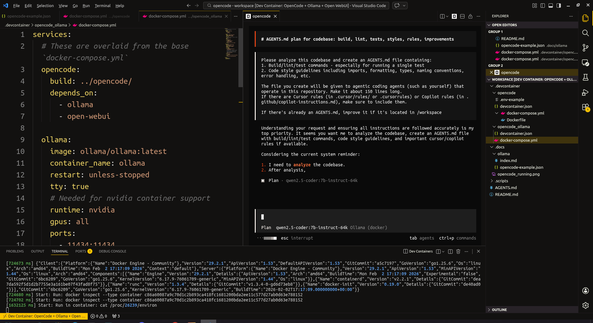

This is a setup configuration for getting started with OpenCode using Ollama "local hosted" models. It provides a containerized development environment with everything needed to run OpenCode with local LLMs.

## Getting Started with OpenCode and Ollama Models

This project uses devcontainers by default to provide a fully functioning OpenCode environment. If your IDE supports devcontainers (like VS Code), it should prompt you to reopen in a container. See the [official devcontainer documentation](https://code.visualstudio.com/docs/devcontainers/containers) for more details.

Here you can see a fully stood up collection of services including opencode and ollama to ensure purely local agentic model usage right out of the box (with the exception of having to prepare models). This represents the full self-contained setup - see the [OpenCode + Ollama + Open WebUI](#opencode--ollama--open-webui) section below, but you can easily use this with a remote Provider.



## Devcontainer Setups

This project provides two devcontainer configurations:

| Folder | Description | Use When |
|--------|-------------|----------|
| `.devcontainer/opencode/` | OpenCode (Standalone) | You already have Ollama running on host or remote |
| `.devcontainer/opencode_ollama/` | OpenCode + Ollama + Open WebUI | You want everything in one place |

Both setups work with any IDE that supports devcontainers. See the appropriate section below for manual Docker Compose instructions.

### Building and Running Manually

If your IDE does not support devcontainers, you can build and run the container manually using Docker Compose.

**OpenCode (Standalone)** (requires external Ollama):

```bash
# add `-d` to run in background
docker compose -f .devcontainer/opencode/docker-compose.yml up --build
```

Once built, attach to the running container to access the OpenCode environment:

```bash
docker exec -it opencode-agent bash
```

To stop:

```bash
docker compose -f .devcontainer/opencode/docker-compose.yml down
# or CTRL+C if running in foreground
```

**OpenCode + Ollama + Open WebUI** (self-contained, requires GPU):

```bash
docker compose -f .devcontainer/opencode/docker-compose.yml -f .devcontainer/opencode_ollama/docker-compose.yml up --build
```

To stop:

```bash
docker compose -f .devcontainer/opencode/docker-compose.yml -f .devcontainer/opencode_ollama/docker-compose.yml down
```

### OpenCode + Ollama + Open WebUI

If you don't have Ollama installed on your host, or want a completely self-contained setup, open the root of this project in your IDE and reload into the `OpenCode + Ollama + Open WebUI` devcontainer. This provides a single configuration that includes:

- **ollama** - Ollama with GPU support (port 11434)
- **open-webui** - Optional web UI for Ollama (port 3000, auth disabled)
- **opencode** - The OpenCode agent

> **Important:** NVIDIA GPU support requires the [NVIDIA Container Toolkit](https://docs.nvidia.com/datacenter/cloud-native/container-toolkit/latest/install-guide.html) to be installed on your host machine.

> **Important:** This setup uses Docker Compose overlays - the `opencode_ollama` folder's compose file extends the base `opencode` compose file. Your IDE handles this automatically via the `devcontainer.json` `dockerComposeFile` array.

Alternatively, run manually without devcontainers - see the commands in the [Building and Running Manually](#building-and-running-manually) section above.

### Using Multiple Devcontainers

When running the self-contained `OpenCode + Ollama + Open WebUI` setup, you may need to interact directly with the Ollama container (e.g., to pull or manage models). VS Code supports connecting to multiple containers in separate windows:

1. Open the **root** of this project in VS Code
2. When prompted to reload into a devcontainer, select `OpenCode + Ollama + Open WebUI` from the list
3. To connect to the `ollama` service instead:
   - Run **Dev Containers: Attach Shell** from the Command Palette
   - Select the `ollama` container when prompted

See the [official VS Code documentation](https://code.visualstudio.com/remote/advancedcontainers/connect-multiple-containers) for more details.

To interact with Ollama from within its container:

```bash
docker exec -it ollama bash
# Then run ollama commands, e.g.:
ollama pull qwen2.5:14b-instruct
ollama list
```

### Running OpenCode

Once connected to the `opencode` container (either through VS Code devcontainer or `docker exec`), you can start using OpenCode:

**Via VS Code:**
- Open the root of this project in VS Code and reload into any devcontainer
- Open a terminal in VS Code (Terminal → New Terminal) and run `opencode`
- Alternatively, the pre-configured [official extension](https://opencode.ai/docs/ide/) has entries in the command pallete, as well as a keybind. 

**Via Docker exec:**
```bash
docker exec -it opencode-agent bash
# Then run opencode
opencode
# or, directly:
docker exec -it opencode-agent opencode
```

**Starting the Web UI:**

You can also start the OpenCode web interface:

```bash
opencode web --hostname 0.0.0.0 --port=4096
# or, directly:
docker exec -it opencode-agent opencode web --hostname 0.0.0.0 --port=4096
```

> If VS Code is actively connected tot he devcontainer, it will auto-forward ports. Should you be running manually, you'll need to ensure the port is correct and matches the forward in the [docker-compose.yml](.devcontainer/opencode/docker-compose.yml) file.

This will start the web UI which you can access at `http://localhost:4096` (or your container's IP if running remotely).

## Model Selection Requirements

To work well with OpenCode, ensure your selected models meet these criteria:

* Models must be pulled into Ollama from the provider's source repository (e.g., `qwen2.5:14b-instruct`)
* Adapted to fit a minimum context window of 64k tokens and uniquely named (e.g., `qwen2.5:14b-instruct-64k`)
* Configured within your OpenCode provider model map for seamless integration (see [.docs/ollama/opencode-example.json](.docs/ollama/opencode-example.json))

This project includes helper files to simplify setup:

* [.docs/ollama/opencode-example.json](.docs/ollama/opencode-example.json) - Example configuration with suggested models that work well with OpenCode
* [.scripts/ollama_setup.sh](.scripts/ollama_setup.sh) - Helper script that pulls and configures models with 64k context window variants. Run this inside the Ollama container (via `docker exec -it ollama bash`) or on a host with Ollama accessible.
